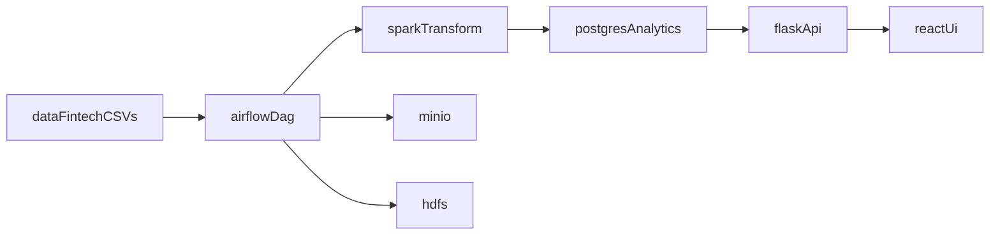

# System Architecture

## Logical flow

## Components
- React UI (`apps/frontend`) for dashboard and KPI display.
- Flask API (`apps/backend`) exposing operational and KPI endpoints.
- Airflow (`infra/airflow/dags`) for orchestration and retry control.
- Spark (`infra/spark/jobs`) for parallel transformations.
- Hadoop (HDFS + YARN services in compose) for distributed storage/runtime demonstration.
- Postgres `analytics` database for curated result-store tables.

