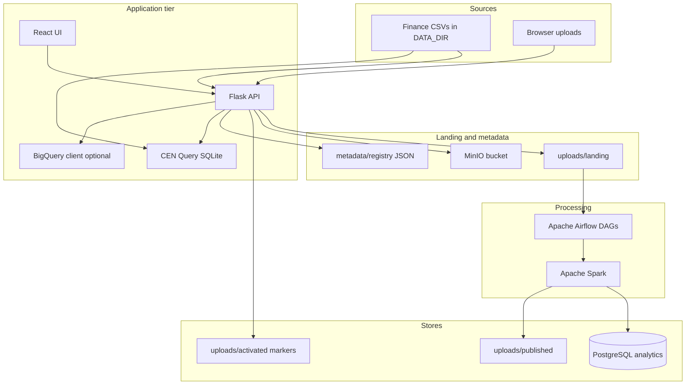
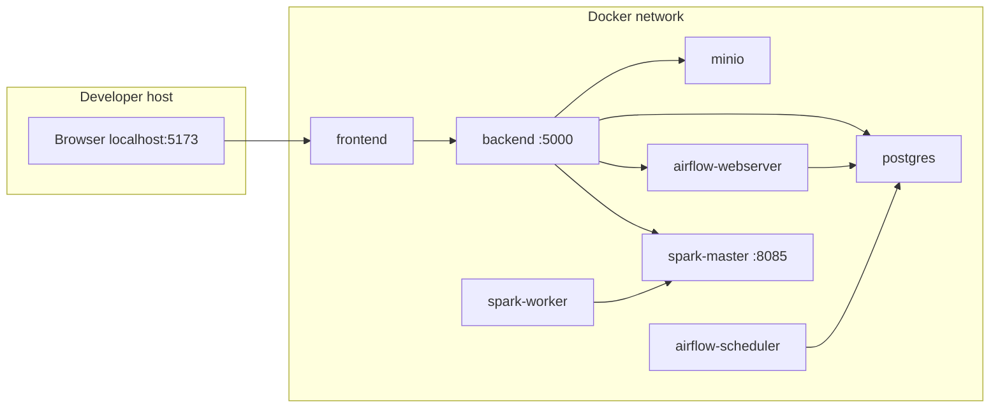
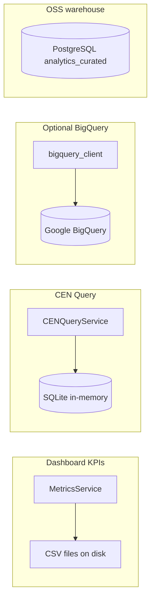
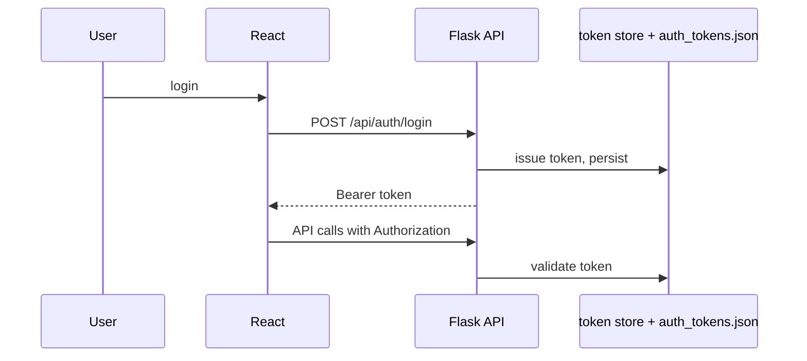

# System Architecture

This document describes the **logical and runtime architecture** of the Distributed Data Processing Pipeline: web console, API, data directories, orchestration, processing engines, and optional integrations. It complements **`README.md`** and **`MILESTONE1_SRS.md`**.

---

## 1. Architectural goals

| Goal | How it is addressed |
|------|---------------------|
| **Reproducible stack** | `docker-compose.yml` defines services, volumes, and environment |
| **Batch orchestration** | Apache Airflow DAGs under `infra/airflow/dags/` |
| **Parallel analytics** | Apache Spark Standalone (master + worker) + jobs in `infra/spark/jobs/` |
| **Durable landing** | MinIO (S3-compatible) + bind-mounted `data/fintech` |
| **OSS analytical store** | PostgreSQL database `analytics` with schema `analytics_curated` |
| **Operational UI** | React (Vite) + Flask REST API with role-based access |
| **Ad hoc SQL** | CEN Query (SQLite over CSVs) and optional BigQuery (read-only) |

---

## 2. High-level logical flow

End-to-end data movement from files and uploads through landing, optional Spark/Airflow processing, and consumption via API and UI.

---

## 3. Runtime view (Docker Compose)

Typical **default** services (Hadoop is optional behind a profile).

- **Backend** mounts **`./data/fintech` → `/data`** (`DATA_DIR`) and **`./secrets` → `/secrets`** (read-only) for optional GCP credentials.
- **Frontend** calls the API using `VITE_API_BASE_URL` (e.g. `http://localhost:5000`).

---

## 4. Component reference

| Component | Location / image | Responsibility |
|-----------|------------------|----------------|
| **React UI** | `apps/frontend` | Dashboard, uploads, datasets, ETL, query workspace (CEN + BigQuery), audit, users; Bearer auth |
| **Flask API** | `apps/backend` | REST `/api/*`, metrics, pipeline, CEN SQL, BigQuery proxy, Airflow/MinIO/Spark integration |
| **PostgreSQL** | `postgres:15-alpine` | Airflow metadata DB + **`analytics`** database (`infra/postgres/init.sql`) |
| **MinIO** | `minio/minio` | S3-compatible landing bucket (`fintech-landing` default) |
| **Airflow** | Custom image (`infra/docker/airflow`) | Scheduler + webserver; DAGs; Spark client in image for `spark-submit` |
| **Spark** | Bitnami Spark 3.5.x | Standalone master + worker; PySpark jobs from `/opt/spark-jobs` |
| **Hadoop** (optional) | `bde2020/*` images | HDFS + YARN + history — `docker compose --profile hadoop` |

---

## 5. Data directories (`DATA_DIR`)

Default in containers: **`/data`** ← host **`./data/fintech`**.

| Path | Purpose |
|------|---------|
| `*.csv` (root) | Published finance dimensions/facts for KPIs and CEN Query |
| `uploads/landing/` | New uploads (timestamped filenames) |
| `uploads/processing/` | Intermediate copies during processing |
| `uploads/published/` | Published outputs |
| `uploads/activated/` | **Markers** (e.g. `*.csv.analytics_ready`) for dashboard/CEN gating |
| `uploads/metadata/` | `dataset_registry.json`, `audit_logs.json`, `etl_jobs.json`, `users.json`, `auth_tokens.json` |

The **MetricsService** aggregates KPIs from CSVs under `DATA_DIR`; **CENQueryService** loads gated CSVs into SQLite for read-only SQL.

---

## 6. Query and analytics paths

- **Dashboard / top merchants:** CSV-driven (`fact_transactions`, `dim_merchants`, etc.).
- **CEN Query:** `SELECT`/`WITH` only; tables mirror `analytics_ready` basename CSVs.
- **BigQuery:** Read-only when `GOOGLE_APPLICATION_CREDENTIALS` or `BIGQUERY_CREDENTIALS_PATH` resolves; optional load job on upload if enabled.
- **PostgreSQL `analytics_curated`:** Populated by ETL/Spark pipelines for warehouse-style validation queries (`docs/validation_queries.sql`).

---

## 7. Authentication and session model

- **Bearer tokens** are validated per request; tokens may be **persisted** under `uploads/metadata/auth_tokens.json` so sessions survive API restarts.
- **Roles:** `admin`, `data_engineer`, `analyst`, `operator` — permissions enforced in API decorators and reflected in the UI sidebar.

---

## 8. Orchestration (Airflow)

- **DAGs:** `tiny_pyspark_standalone` (`tiny_pyspark_dag.py`), `distributed_pipeline_scaffold` (`pipeline_scaffold.py`).
- **Backend** triggers DAGs via Airflow REST API with basic auth (`AIRFLOW__API__AUTH_BACKENDS` must include `basic_auth`).
- **Spark jobs** on host: `infra/spark/jobs` → mounted in Airflow and Spark containers.

---

## 9. Failure isolation (summary)

| Layer | Mechanism |
|-------|-----------|
| **Containers** | `restart: unless-stopped`; healthchecks on backend, postgres, spark-master, minio |
| **Airflow** | Task retries (DAG configuration); task logs under `infra/airflow/logs` |
| **Spark** | Stage/task retries per Spark; worker failures visible in Spark Master UI |
| **API** | Stateless HTTP; token persistence mitigates restart impact on user sessions |

See **`docs/FAULT_TOLERANCE.md`** for extended narrative.

---

## 10. Related documents

| Document | Content |
|----------|---------|
| `README.md` | Bring-up, ports, env vars, layout |
| `MILESTONE1_SRS.md` | Requirements traceability |
| `docs/SECURITY_CONFIGURATION.md` | Security notes |
| `docs/SCALABILITY_ANALYSIS.md` | Scale-out discussion |
| `docs/validation_queries.sql` | SQL validation examples |

---

*Architecture diagram (course submission): export Mermaid from this file or use the diagrams in §2–§3 for your report.*
